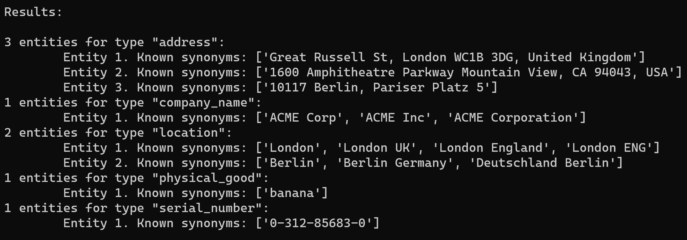
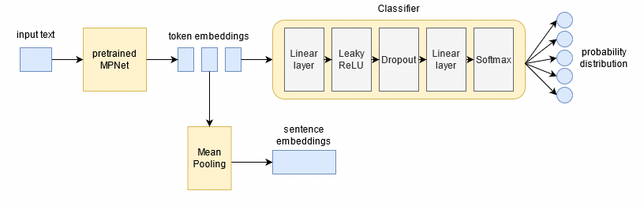
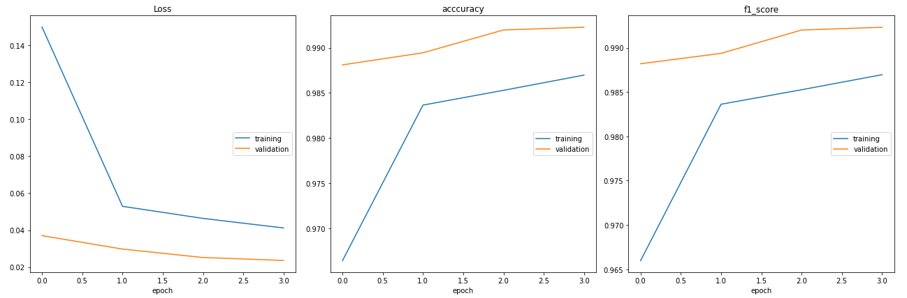

# Entity-Normalization-Engine

This application can classify entities to one of four categories (company name, company address, physical good, serial
number, location)  and match unique entities for each of them. For example: "London", "London ENG" and "London England" are
the same entity, but they are different from "Berlin".



## How It Works



The user input is processed by a pretrained [MPNet](https://arxiv.org/abs/2004.09297) model that returns token embeddings - a
vector representation for each token (word or subword) of our input string. These token embeddings will be used

* in the classifier: based on the vector representation, the input will be assigned to one of the classes. A simple neural
  network is trained for this purpose. It consists of three layers: one hidden layer with a Leaky ReLU activation function, a
  Dropout layer and an output layer that uses a Softmax activation function to generate a valid probability distribution.

* to compute sentence embeddings: we want to process the input data as a whole, so that we can compare it with other input
  data and decide if they are the same entity. Mean Pooling generates a fixed-size 768-dimensional vector representation for
  our string. This sentence embeddings will be compared to the sentence embeddings of other inputs using
  a [cosine similarity](https://en.wikipedia.org/wiki/Cosine_similarity) metric, if the result is greater than the threshold
  value, we consider it to be the same entity.

## Getting Started

### Run with Docker

With Docker, you don't need to install any dependencies. Just run the container with a single command:

```shell
docker run -it maksimm/entity-normalization-engine
```

Note: Currently, the Docker image only supports CPU-inference.

## Developer Setup

### Run locally

If you don't want to run the application using Docker, follow these step:

1. Clone the repository
2. Create and activate a new Python virtual environment:
    ```shell
    python3 -m venv entity-normalization-engine
    source entity-normalization-engine/bin/activate
    ```
3. The PyTorch and Transformers dependencies are not listed in requirements files, must be installed depending on your
   machine (CPU or GPU inference, different versions of CUDA).

   Follow the official instructions for installation
   with `pip`: [PyTorch](https://pytorch.org/get-started/locally/#start-locally)
   , [Transformers](https://huggingface.co/transformers/installation.html#installation-with-pip)
4. Install runtime dependencies:
    ```shell
    pip3 install -r inference-requirements.txt
    ```
5. [Download](https://github.com/maksim-m/Entity-Normalization-Engine/releases/latest) the pretrained model file and save it
   into the project's root directory
6. Run the app:
   ```shell
   python3 main.py
   ```

### Training

A few more dependencies must be installed to train the network. Follow the steps from "Run Locally" and then execute:

```shell
pip3 install -r requirements.txt
```

Now you can train the model using `classification/train_classifier.ipynb` notebook.



## Licence

    Copyright 2021 Maksim Moiseikin

    Licensed under the Apache License, Version 2.0 (the "License");
    you may not use this file except in compliance with the License.
    You may obtain a copy of the License at

       http://www.apache.org/licenses/LICENSE-2.0

    Unless required by applicable law or agreed to in writing, software
    distributed under the License is distributed on an "AS IS" BASIS,
    WITHOUT WARRANTIES OR CONDITIONS OF ANY KIND, either express or implied.
    See the License for the specific language governing permissions and
    limitations under the License.
